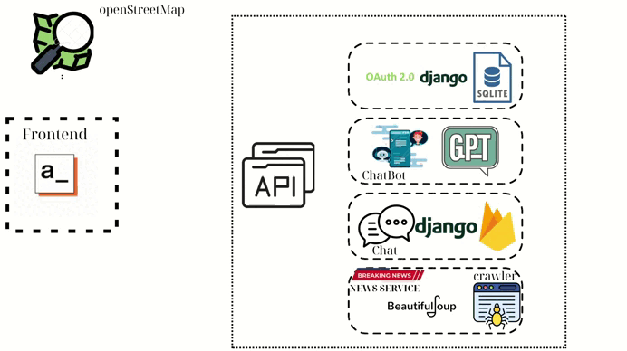
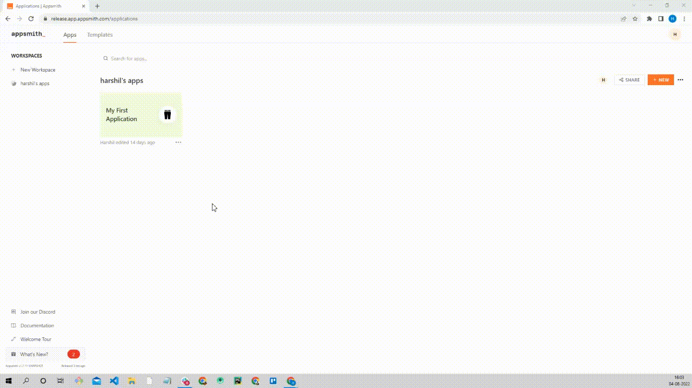

[](https://www.apache.org/licenses/LICENSE-2.0)
[](https://www.python.org/downloads/release/python-3127/)


# Disaster And Charity App

This application was developed as part of the **[Open Source Software - OLP 2024](https://www.olp.vn/procon-pmmn/ph%E1%BA%A7n-m%E1%BB%81m-ngu%E1%BB%93n-m%E1%BB%9F)**, with the primary purpose of supporting communities in effectively responding to emergency situations such as natural disasters, pandemics, and other crises. By leveraging the Low-Code Development Platform (LCDP), the project aims to significantly reduce development time while ensuring adaptability and functionality in critical scenarios.

The application facilitates rapid information dissemination, enhances connectivity among community members and organizations, and provides tools to aid disaster response and recovery efforts. This project not only demonstrates the potential of low-code technology in real-world applications but also highlights its significance in addressing urgent societal challenges.

**NOTE**:

- The presentation slides can be accessed [here](https://www.canva.com/design/DAGYlS2P72c/TwEkriPqEOpjaLw55xBNbQ/edit).

# Table of Contents

1. [Introduction](#introduction)
   - [Technology used](#technology-used)
   - [Main Features](#main-features)
   - [Deployment](#deployment)
   - [Project Structure](#project-structure)
2. [How to install](#how-to-install)
   - [Prerequisites](#prerequisites)
   - [With Docker](#with-docker-recommended)
   - [Manually](#manually)
3. [Contributing](#contributing)
4. [Author](#author)
5. [LICENSE](#license)

# Introduction

## System Architecture



## Technology used

- **Appsmith**: A low-code platform for building user interfaces and connecting to data sources quickly.
- **Django**: A Python-based framework for building the backend with a focus on security, scalability, and maintainability.

## Main Features

<details>
<summary><b>1. Community Donation Platform</b></summary>

- **Multi-Model Donations**: Supports diverse donation methods, including cash, physical goods, and online payments through popular channels.
- **Transparency and Accountability**: Displays detailed contribution data, including total funds/items collected, donor information, and fund allocation.
- **User-Friendly Interface**: Offers an intuitive interface for easy access and streamlined donation processes.
</details>

<details>
<summary><b>2. News Aggregation and Analysis System</b></summary>

- **Curated Information**: Collects and filters news from reliable media sources focusing on pandemics, natural disasters, and emergencies.
- **Data Analysis**: Identifies trends, statuses, and levels of impact in different regions, improving forecasting and response capabilities.
- **Categorized Content**: Organizes information by topics, regions, and urgency, allowing users to quickly access relevant updates.
</details>

<details>
<summary><b>3. Local Positioning and Information Provision</b></summary>

- **GPS Integration**: Identifies the user's current location using GPS technology.
- **Localized Updates**: Provides real-time information on risks such as diseases and natural disasters in the user’s area.
- **Personalized Solutions**: Suggests tailored preventive measures and response strategies based on the user's location and circumstances.
</details>

<details>
<summary><b>4. Support Handbook via Chatbot</b></summary>

- **Interactive Assistance**: A chatbot that interacts with users to provide information, answer queries, and offer support in emergencies.
- **Multilingual Support**: Accommodates global users by offering support in multiple languages.
</details>

<details>
<summary><b>5. White Label Customization</b></summary>

- **Brand Adaptability**: Allows customization of the system's interface and functionalities to align with an organization's branding and needs.
- **Donation and Language Configuration**: Supports integration of specific donation types and languages tailored to target audiences.
</details>

<details>
<summary><b>6. Emergency Contact Channel</b></summary>

- **Directory Access**: Provides a comprehensive directory of emergency contact numbers, including rescue services, medical assistance, and relief organizations.
- **Quick Call Integration**: Enables users to make direct calls to critical contacts through the application for immediate help in emergencies.
</details>

## Deployment

...

## Project Structure

The project is organized into the following structure:

```
PMNM_DisasterAndCharityApp/
├── BE/                  # Backend folder (Django server)
│   ├── manage.py        # Entry point for the Django server
│   ├── requirements.txt # Python dependencies for the backend
│   ├── Dockerfile       # Docker configuration for the backend
│   ├── db.sqlite3       # SQLite database file (for development)
│   ├── CharityProject/  # Django project settings and configurations
│   ├── CharityApp/      # Application-specific logic for the backend
│   └── templates/       # HTML templates for the backend
├── FE/                  # Frontend folder (Appsmith)
│   └── app.json         # Appsmith application configuration
└── docker-compose.yml   # Docker Compose file to orchestrate both backend and frontend
```

# How to install

## Prerequisites

Before installing, ensure you have the following installed:

- Python 3.12.7 or later
- Docker (optional, for running Appsmith easily)

## Installation Steps

### With Docker (recommended)

1. **Clone the Repository**

```bash
git clone https://github.com/HPhat03/PMNM_DisasterAndCharityApp.git
cd PMNM_DisasterAndCharityApp
```

2. **Run Project**

```bash
docker compose up -d
```

### Manually

1. **Clone the Repository**

```bash
git clone https://github.com/HPhat03/PMNM_DisasterAndCharityApp.git
cd PMNM_DisasterAndCharityApp
```

2. **Set Up the Backend**

- Change working directory to Backend:

```bash
cd BE
```

- Create Virtual Environment & Activate:

```bash
python3 -m venv .venv
source .venv/bin/activate
```

- Install dependencies:

```bash
pip install -r requirements.txt
```

- Run migrations:

```bash
python3 manage.py migrate
```

- Start the backend server:

```bash
python3 manage.py runserver
```

3. **Set Up Appsmith**



# Contributing

## Contributing Guidelines

Read through our [contributing guidelines][contributing] to learn about our submission process, coding rules, and more.

## Want to Help?

Want to report a bug, contribute some code, or improve the documentation? Excellent! Read up on our guidelines for [contributing][contributing] and then check out one of our issues labeled as <kbd>[help wanted](https://github.com/HPhat03/PMNM_DisasterAndCharityApp/labels/help%20wanted)</kbd> or <kbd>[good first issue](https://github.com/HPhat03/PMNM_DisasterAndCharityApp/labels/good%20first%20issue)</kbd>.

## Code of Conduct

Help us keep the app open and inclusive. Please read and follow our [Code of Conduct][codeofconduct].

# Author

- [Mai Hoang Phat](https://github.com/HPhat03)
- [Dang Xuan Phat](https://github.com/xuanphat11112003)
- [Tsan Quy Thanh](https://github.com/quythanh)

# License

This project is licensed under the terms of the [Apache License 2.0](http://www.apache.org/licenses/) license.

[codeofconduct]: CODE_OF_CONDUCT.md
[contributing]: CONTRIBUTING.md
